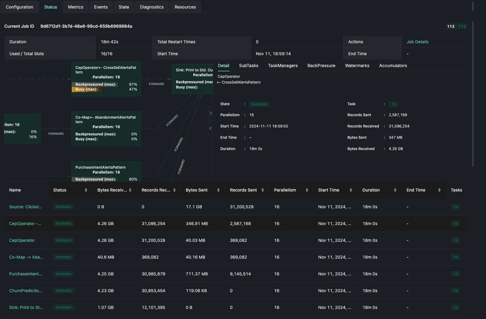

Complex Event Processing In E-Commerce
--------------------------------------
This repo contains sample code to demonstrates Complex Event Processing (CEP) in the context of E-commerce Platforms.

    

## Pattern Identification for E-commerce Scenarios
### Pattern 1: Cross-Sell and Upsell Opportunities
- **How It Works:** This pattern looks for two sequential `view` events within the same session, where the user views products in different categories within a **5-minute window**.
- **Pattern:** The pattern starts with a **view** event (first_view) and then looks for a second **view** event (second_view). In the PatternSelectFunction, we check if the categories of the two viewed products are different.
- **Goal:** The goal is to identify cross-selling or upselling opportunities by detecting when a user shows interest in products from multiple categories. This can trigger a recommendation for complementary products or accessories.

### Pattern 2: High-Value Cart Abandonment Detection with Timeout
- **How It Works:** This pattern monitors high-value items added to the cart (over a certain price threshold) and waits for a "purchase" event within a **10-minute window**. If no purchase event occurs within this timeframe, it triggers a timeout alert for potential cart abandonment.
- **Pattern:** The pattern begins with a **cart** event (cart_add) for a high-value item, followed by an optional **purchase** event (purchase). If a purchase doesn’t occur within 10 minutes, the PatternTimeoutFunction generates an abandonment alert.
- **Goal:** The goal is to identify potential cart abandonment for high-value items. This alert can prompt targeted follow-up actions, such as sending a reminder email or discount offer to encourage purchase completion.

### Pattern 3: Purchase Intent Scoring Based on User Engagement
- **How It Works:** This pattern detects when a user repeatedly views the same product multiple times within a short window (15 minutes). Repeated views of the same product indicate a high likelihood of purchase intent.
- **Pattern:** The pattern starts with an initial **view** event (initial_view) and then looks for at least two additional **view** events (repeat_view) for the same product within a **15-minute window**.
- **Goal:** The goal is to assess purchase intent by identifying users who repeatedly view the same product, suggesting strong interest. This can trigger a personalized message, such as a reminder or targeted offer, to encourage purchase.

### Pattern 4: Price Sensitivity Detection
- **How It Works:** This pattern identifies users who repeatedly view a product but only add it to the cart when the price drops, indicating price sensitivity.
- **Pattern:** The pattern starts with an **initial_view** event, followed by a **view_price_drop** event, where the product price is lower than in the initial view. Finally, the user adds the product to the cart (cart_after_price_drop).
- **Goal:** The goal is to identify price-sensitive users who only proceed when the price decreases. This insight can trigger future price alerts, targeted promotions, or personalized pricing strategies for such users.

### Pattern5: Churn Prediction for Frequent Viewers Without Conversion
- **How It Works:** This pattern detects users who view multiple products across sessions within a week but never make a purchase, indicating potential churn risk.
- **Pattern:** The pattern begins with multiple **view** events (first_view) over a 7-day period without a "purchase" event.
- **Goal:** The goal is to identify users at risk of churning due to frequent browsing without conversion. This alert can trigger retention campaigns, targeted offers, or engagement strategies to reduce the likelihood of churn.

Sample Output
--------------

    

